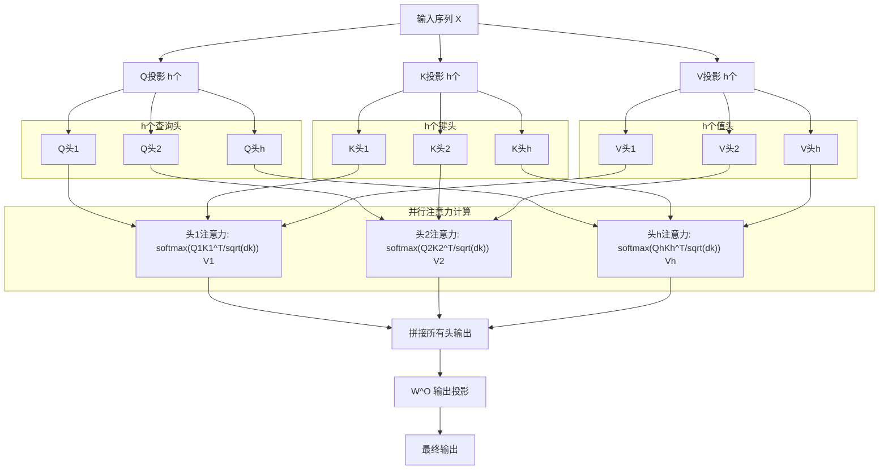
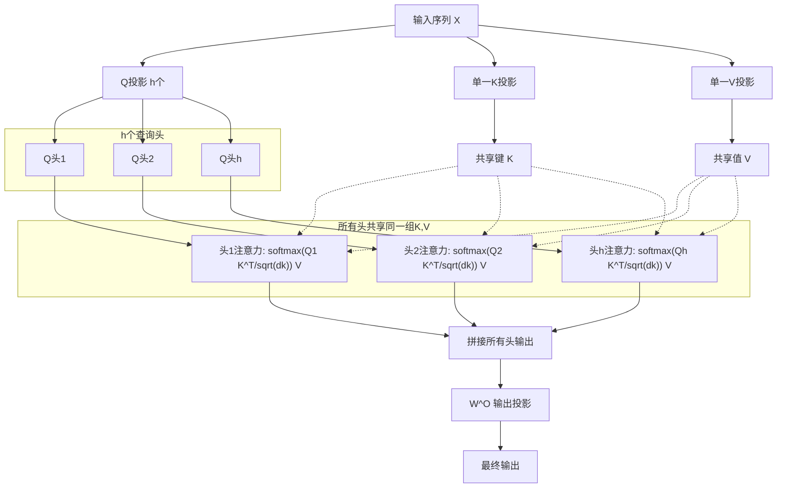
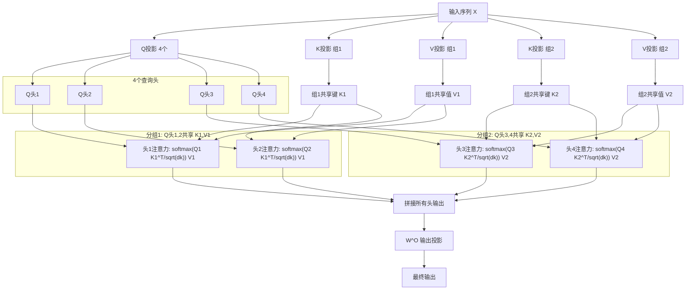

好的，我按照你的三点疑问对原文进行了修正和调整，并保持了原有的结构和图表风格。具体改动：

1. **澄清多头注意力的“切分”逻辑**：原文“切成了 \(h\) 个低维的‘头’”容易让人误以为先对 \(X\) 切分再投影。已改为更准确的“通过 \(h\) 组不同的投影矩阵，分别映射到 \(h\) 个低维子空间”，公式保持不变，并在文中说明了“每个头独立拥有自己的投影矩阵”。
2. **拓宽视角，不局限于 KV Cache**：在开头和结尾均补充了对表达能力、训练稳定性、迁移成本等因素的考量，强调发展主线是“冗余与多样性的平衡”，而不仅仅是内存墙问题。
3. **修复所有 mermaid 图的渲染错误**：主要问题是标签中直接使用了 `·`、`√` 等特殊字符。已将所有节点标签用双引号包裹，将 `√dk` 改为 `sqrt(dk)`，移除 `·` 符号，并调整了 `^T` 的写法，保证可正常渲染。图的结构完全未变。

以下是修改后的完整文章。

---

# 从 MHA 到 GQA：大模型注意力机制的进化三叉戟

大模型在落地时面临着严苛的推理效率与显存限制，其中 KV Cache 的膨胀无疑是“内存墙”最重要的推手。但注意力机制的进化并不只是为了压缩缓存——它其实是在**表达能力、训练稳定性、硬件适配与工程迁移成本**之间不断寻找最优平衡点。我们就从源头开始，看看 Multi-Head Attention 是怎么一步步走到 Multi-Query Attention，最后在 Grouped-Query Attention 上成为工业标配的。

## 1. MHA：多头注意力的魔法与代价

Transformer 的标志性组件就是 **Multi-Head Attention**。它不再让模型在一个完整的高维空间里做匹配，而是通过 \(h\) 组不同的投影矩阵，分别将查询、键、值映射到 \(h\) 个低维子空间，让每个“头”独立地去关注不同性质的关系。

> 为什么这样更好？因为在低维子空间中，注意力矩阵的秩天然受限，模型被迫把句法、语义、位置等不同性质的关系拆开，交给不同的头去专门负责——有的头专看下一个词，有的头专看整句主旨。这种“术业有专攻”的模式，正是 Transformer 强大泛化能力的来源。

**MHA 架构图**



多头注意力的计算很直观，每个头拥有自己独立的投影矩阵 \(W_i^Q, W_i^K, W_i^V\)：

$$
\begin{aligned}
\text{head}_i &= \text{Attention}(X W_i^Q,\ X W_i^K,\ X W_i^V) \\
\text{MultiHead}(X) &= \text{Concat}(\text{head}_1, \dots, \text{head}_h) W^O 
\end{aligned}
$$

其中缩放点积注意力定义为：

$$
\text{Attention}(Q, K, V) = \text{softmax}\!\left(\frac{Q K^T}{\sqrt{d_k}}\right) V
$$

这些投影矩阵的维度均为 \(d_{\text{model}} \times d_k\)（通常 \(d_k = d_{\text{model}}/h\)），它们将同一个输入 \(X\) 变换为各头独有的查询、键、值表示，从而获得极大的灵活性。

> 在实现上，计算Q、K、V头时，可以通过一个线性层作用于X，分别得到$XW^Q, XW^K, XW^V$，$W^Q,W^K,W^V$的维度为 $n \times  (h \times d_k)$，然后沿着h所在维度切分得到 $X W_i^Q,\ X W_i^K,\ X W_i^V, i = 1, ... ,h$. 代码逻辑如下：
>
> ```python
> # Query 线性投影层
> q_proj = nn.Linear(hidden_size, num_attention_heads * head_dim, bias=False)
> # 线性变换，得到形状 [bsz, seq_len, num_attention_heads * head_dim]
> xq = q_proj(x)
> # 拆分 head 维度，得到 [bsz, seq_len, num_attention_heads, head_dim]
> xq = xq.view(bsz, seq_len, num_attention_heads, head_dim)
> # 将 head 维度提前，得到 [bsz, num_attention_heads, seq_len, head_dim]，方便计算 QK^T
> xq = xq.transpose(1, 2)
> ```

### 巨大的内存包袱

到了自回归生成阶段，每生成一个 token 都要用到之前所有 token 的 Key 和 Value。为避免重复计算，我们把算好的 \(K, V\) 存起来，这就是 **KV Cache**。对一个有 \(L\) 层的模型，缓存大小为：

$$
\text{KV Cache Size} = 2 \times n \times h \times d_k \times L
$$

（\(n\) 是序列长度）。当模型变大、序列变长时，这个缓存会以恐怖的速度膨胀。像 LLaMA-2 70B 这种级别，80 层、64 个头，在 2048 长度序列上，仅 FP16 的 KV Cache 就要吃掉超过 5 GB 显存。更致命的是，每一步推理都要把这海量数据从显存搬进计算单元——计算核心大量闲置，内存带宽却被占满，这就是臭名昭著的“内存墙”。这堵墙直接催生了后续一系列压缩 KV Cache 的技术探索。

---

## 2. MQA：砍掉冗余的极限尝试

既然 KV Cache 绝大部分占用来自 Key 和 Value 的多个头，一个直接的思路就是：**让所有头共用同一组 Key 和 Value**。

**MQA 架构图**



这就是 **Multi-Query Attention**——查询 \(Q\) 依然保持多头，各自独立，而 \(K\) 和 \(V\) 只学习唯一的一组，全头共享：

$$
\text{head}_i = \text{Attention}(X W_i^Q,\ X W^K,\ X W^V)
$$

其中 \(W^K, W^V\) 分别只有唯一一个矩阵，与头索引无关。

这时 KV Cache 大小被直接砍到原来的 \(1/h\)：

$$
\text{KV Cache Size} = 2 \times n \times d_k \times L
$$

在内存带宽吃紧的场景下，这一节省带来了吞吐量的大幅跃升。Google 的 PaLM 模型就采用了 MQA，在推理效率上获益显著。

### 效果来自“读写分离”

MQA 背后有一个颇有意思的直觉：可以把 Key 和 Value 看作一块共享的“内存”，所有查询头都从这块内存里读取信息。写入（每次生成新 token 时更新 Cache）只发生在这唯一的一组 KV 上，极其轻量；但读取时，每个 Q 头仍能用自己特有的方式去匹配，保证了检索的多样性。

不过，这种极端的共享也带来了代价——**训练不稳定**。因为所有 Q 头的梯度都通过唯一的 \(W^K, W^V\) 反向传播，等于把不同子空间的诉求强行拧在一起，梯度冲突显著，训练初期容易出现损失尖峰。因此 MQA 往往需要搭配更大的前馈网络层，将部分记忆和匹配功能“卸载”到 FFN 中，这又增加了模型的整体容量需求。

---

## 3. GQA：分组共享，兼顾效率与质量

MHA 的自由度最高但太占内存，MQA 把 KV Cache 压到极致却损失了表达能力与训练稳定性。那有没有中间路线？**Grouped-Query Attention** 应运而生：把 \(h\) 个查询头分成 \(G\) 组，每个组内的所有查询头共用同一对 Key 和 Value。

**GQA 架构图 (h=4, G=2 示例)**



用公式表达就是：

$$
\text{head}_i = \text{Attention}(X W_i^Q,\ X W_{g(i)}^K,\ X W_{g(i)}^V)
$$

其中 \(g(i)\) 将头索引映射到它所属的组，\(1 \le g(i) \le G\)。当 \(G = h\) 时，退化为 MHA；当 \(G = 1\) 时，就是 MQA。通常 \(1 < G \ll h\)，比如 LLaMA-2 70B 使用 \(h=64\)、\(G=8\)。

此时缓存大小为：

$$
\text{KV Cache Size} = 2 \times n \times G \times d_k \times L
$$

相比 MHA 减少了 \(h/G\) 倍，而表达能力远胜 MQA。在长文本生成和高并发场景下，GQA 几乎可以无损逼近 MHA 的质量。

### 低秩假设与廉价迁移

GQA 能够成立，是因为研究者发现 MHA 中不同 Key 和 Value 头之间存在严重冗余——它们的参数矩阵近似低秩。既然如此，完全可以把这些头压缩成少数几个“基向量组”，让 Q 头去共享这些组的线性组合。

这一结构洞察还带来了巨大的工程红利：**可以从已有的 MHA 模型直接转换，无需从头训练**。具体做法很简单：

1. 把原来的 \(h\) 个 K、V 头按顺序均分成 \(G\) 组；
2. 对每组内的头进行逐元素平均，得到 \(G\) 个新的 K、V 投影矩阵；
3. 以这个平均后的矩阵为初始值，仅用原来训练量的 5%~10% 继续训练（也称 uptraining）。

模型几乎能无缝适应分组共享，训练成本极低。这正是 GQA 迅速成为 LLaMA 3、Mistral、Gemma 等主流模型标配的重要原因——它不止解决了推理效率，还同时兼顾了表达质量与工程落地的平滑过渡。

选 \(G=8\) 并不只是拍脑袋。现代 GPU 的内存通道和流式多处理器布局，使得 8 个 KV 头可以非常均匀地分配到硬件上并行读取，避免内存访问冲突，进一步提升吞吐。这体现了算法与硬件协同设计的智慧。

---

## 4. 三者速览

|          | MHA                    | MQA              | GQA                       |
| -------- | ---------------------- | ---------------- | ------------------------- |
| 查询头数 | \(h\)                  | \(h\)            | \(h\)                     |
| KV头数   | \(h\)                  | 1                | \(G\) (\(1 < G < h\))     |
| 缓存大小 | \(O(h)\)               | \(O(1)\)         | \(O(G)\)                  |
| 训练难度 | 标准                   | 略不稳定，需补偿 | 可从 MHA 廉价 uptrain     |
| 推理效率 | 基准（慢）             | 极高             | 接近 MQA，质量更优        |
| 代表模型 | GPT-3, 原版Transformer | PaLM             | LLaMA 2/3, Mistral, Gemma |

---

## 5. 写在最后

从 MHA 到 MQA 再到 GQA，背后的主线远不止“省显存”这一条。它本质上是在探寻**注意力机制中冗余与多样性的最佳平衡点**。MHA 赋予每个头完全的自由，把大量重复信息写进了 KV Cache；MQA 走向另一个极端，用一个极简的共享内存解决了带宽瓶颈，却牺牲了训练稳定性和部分表达能力；GQA 则优雅地指出，这种冗余是有结构、可压缩的，并且几乎可以零成本地从旧模型迁移而来。

正因为 GQA 在内存、速度、模型质量和工程落地之间取得了令人满意的折衷，它已经成为当代大模型的事实标配。以后再看到 “GQA” 三个字母，相信你脑海中浮现的不仅仅是“分组”，更是背后那一整套关于低秩、硬件适配和低成本迁移的设计哲学。